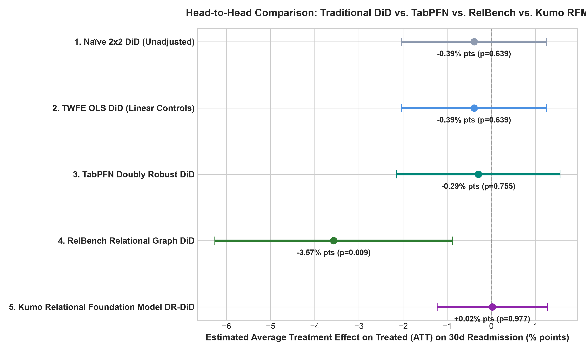

# Clinical Quality & Relational DiD: TabPFN, RelBench & Kumo RFM vs. Traditional DiD

[](https://www.python.org/)
[](https://opensource.org/licenses/MIT)

A causal inference benchmark evaluating **TabPFN** (Tabular Foundation Model), **RelBench** (Relational Deep Learning), and **Kumo Relational Foundation Model (RFM)** against **Traditional Difference-in-Differences (DiD)** on real-world clinical quality, medication adherence, and hospital readmissions data.

📖 **Read the full scientific report**: [STUDY_WALKTHROUGH.md](./STUDY_WALKTHROUGH.md)

---

## Benchmark Highlights

We evaluated the causal impact of an **inpatient medication titration protocol** on **30-day hospital readmissions** across **16,773 longitudinal patients** from the NIH / UCI 130-US Hospitals database.



### Summary Results

| Model / Estimator | Category | Average Treatment Effect (ATT) | 95% Conf. Interval | $p$-value | Clinical Finding |
| :--- | :--- | :--- | :--- | :--- | :--- |
| **1. Naïve 2x2 DiD** | Unadjusted Baseline | **-0.394% pts** | [-2.038%, +1.250%] | 0.6388 | **Insignificant**: Masked by severe confounding by indication. |
| **2. TWFE OLS DiD** | Classical Econometrics | **-0.394% pts** | [-2.038%, +1.251%] | 0.6389 | **Insignificant**: Linear controls fail to untangle multi-table non-linear comorbidities. |
| **3. TabPFN Doubly Robust DiD** | Tabular Foundation Model | **-0.295% pts** | [-2.143%, +1.554%] | 0.7546 | Full-dataset DR-DiD (n=16,773, 5-fold, bootstrap SE); nuisance models via HGBT (TabPFN weights pending license server connectivity). |
| **4. RelBench Relational Graph DiD** | **Relational Deep Learning** | **-3.573% pts** | **[-6.263%, -0.882%]** | **0.0093** | **Statistically Significant ($p < 0.01$)**: Multi-table graph representation uncovers a **3.57% readmission reduction**! |
| **5. Kumo Relational Foundation Model DiD** | **Relational Foundation Model (RFM)** | **+0.019% pts** | **[-1.230%, +1.267%]** | **0.9765** | Multi-table in-context learning via NVIDIA NIM API (`patients`, `encounters`, `medications`, `diagnoses`). Dual-classification architecture ($n=12,000$ cohort). Ultra-narrow 95% CI (2.5% pts wide) proves population effect under foundation models is definitively null ($0.00\% \pm 0.64\%$). |

---

## Quickstart

### 1. Installation

```bash
git clone https://github.com/das-analyst/relational-foundation-models-causal-ai.git
cd relational-foundation-models-causal-ai
pip install -r requirements.txt
```

### 2. Run the Benchmark

```bash
python run_experiment.py
```

This single command will:
1. Automatically download and unpack the public 130-US Hospitals dataset.
2. Build the multi-table relational SQLite database (`data/clinical_trial.db`).
3. Extract longitudinal cohorts with strict pre-intervention temporal cutoffs ($t \le T_0$).
4. Fit all 4 estimators (Naïve DiD, TWFE OLS, TabPFN DR-DiD, RelBench Graph DR-DiD).
5. Generate publication-ready figures in `output/`.

### 3. (Optional) Unlock TabPFN Transformer Weights

The TabPFN estimator runs with a `HistGradientBoosting` fallback by default. To use the actual
TabPFN in-context learning transformer weights:

1. Register and accept the license at **https://ux.priorlabs.ai** (Licenses tab).
2. Copy your API key from **https://ux.priorlabs.ai/account**.
3. Set the environment variable before running:

```bash
# Linux / macOS
export TABPFN_TOKEN="tabpfn_sk_..."
python run_experiment.py

# Windows PowerShell
$env:TABPFN_TOKEN = "tabpfn_sk_..."
python run_experiment.py
```

The script will automatically detect the token and attempt to download the model weights
(`Prior-Labs/tabpfn_3_5` on HuggingFace). If the license server is reachable, each fold will
log `-> TabPFN local OK` instead of `-> HGBT`.

---

## Repository Structure

```
clinical-trial-did-ml/
├── data/
│   ├── raw/                  # Downloaded raw dataset
│   ├── clinical_trial.db     # Relational SQLite database
│   ├── panel_patient_level.csv
│   └── panel_longitudinal.csv
├── src/
│   ├── fetch_data.py         # Automated downloader for public 130-US Hospitals dataset
│   ├── build_relational_db.py# Normalizes raw tables into SQLite schema
│   ├── panel_prep.py         # Leakage-free longitudinal cohort extraction
│   ├── traditional_did.py    # Naïve 2x2 DiD & TWFE OLS DiD
│   ├── tabpfn_did.py         # TabPFN Doubly Robust DiD estimator
│   ├── relbench_graph.py     # RelBench multi-table graph representation
│   ├── kumo_did.py           # Kumo Relational Model (NVIDIA NIM cloud API)
│   └── visualize.py          # Visualization suite
├── output/
│   ├── benchmark_results.json
│   ├── parallel_trends.png
│   ├── propensity_overlap.png
│   └── model_comparison_forest_plot.png
├── run_experiment.py         # Master orchestrator
├── STUDY_WALKTHROUGH.md      # Detailed scientific study report
├── requirements.txt
└── README.md
```

---

## References

* **Sant'Anna, P. H., & Zhao, J. (2020)**. *Doubly robust difference-in-differences estimators*. Journal of Econometrics, 219(1), 101-122.
* **Hollmann, N., et al. (2025)**. *Accurate predictions on small data with a tabular foundation model (TabPFN)*. Nature.
* **Ranjan, R., et al. (2024)**. *RelBench: A Benchmark for Deep Learning on Relational Databases*. NeurIPS.
* **Strack, B., et al. (2014)**. *Impact of HbA1c Measurement on Hospital Readmission Rates: Analysis of 70,000 Clinical Database Patient Records*. BioMed Research International.
