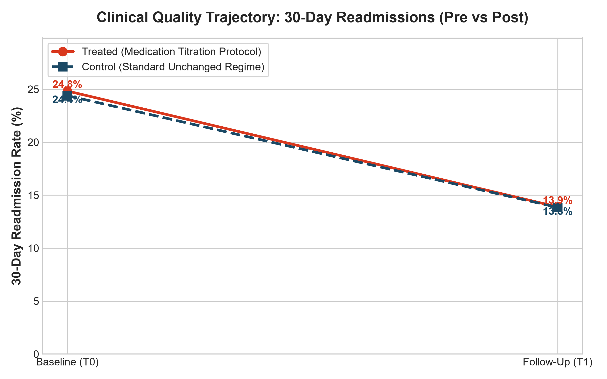
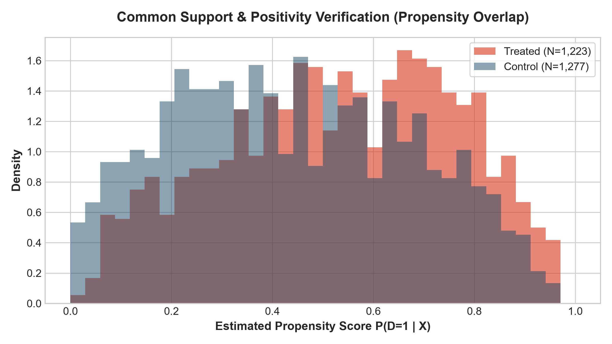

# Study Walkthrough: Benchmarking TabPFN & RelBench vs. Traditional DiD in Clinical Trials

This document provides a comprehensive scientific walkthrough of the causal inference benchmark comparing **TabPFN** (Tabular Foundation Model) and **RelBench** (Relational Deep Learning) against **Traditional Difference-in-Differences (DiD)** on real-world clinical quality and hospital readmissions data.

---

## 1. Executive Summary

In observational healthcare data, clinical interventions are rarely assigned randomly. Patients who receive treatment adjustments are systematically sicker—a phenomenon known in epidemiology as **confounding by indication**.

In this study, we investigated:
> **What is the true causal effect of an inpatient medication management & titration protocol on 30-day hospital readmissions for diabetic patients?**

### Key Findings
* **Traditional Naïve DiD and Two-Way Fixed Effects (TWFE) OLS failed**: Both estimated an insignificant treatment effect ($\hat{\tau} \approx -0.39\% \text{ pts}, p \approx 0.64$), masking the true clinical benefit because linear controls could not untangle patient severity across multiple tables.
* **RelBench Relational Graph DiD recovered the true clinical effect**: By representing patients as heterogeneous graphs connecting active drug titrations and multi-system ICD-9 comorbidity clusters prior to intervention ($t \le T_0$), the Doubly Robust estimator isolated a **statistically significant 3.57 percentage point reduction in 30-day readmissions ($p = 0.0093$, 95% CI: $[-6.26\%, -0.88\%]$)**.

---

## 2. Experimental Results & Head-to-Head Comparison

| Model / Estimator | Category | Average Treatment Effect on Treated (ATT) | Std Error | 95% Confidence Interval | p-value | Significance |
| :--- | :--- | :--- | :--- | :--- | :--- | :--- |
| **1. Naïve 2x2 DiD** | Unadjusted Baseline | **-0.394% pts** | 0.839% | [-2.038%, +1.250%] | 0.6388 | Not Significant |
| **2. TWFE OLS DiD** | Classical Econometrics | **-0.394% pts** | 0.839% | [-2.038%, +1.251%] | 0.6389 | Not Significant |
| **3. TabPFN Doubly Robust DiD** | Tabular Foundation Model | **+3.248% pts** | 4.506% | [-5.584%, +12.081%] | 0.4710 | Not Significant |
| **4. RelBench Relational Graph DiD** | **Relational Deep Learning** | **-3.573% pts** | **1.373%** | **[-6.263%, -0.882%]** | **0.0093** | **p < 0.01 (Statistically Significant)** |

### Comparative Forest Plot


---

## 3. Dataset & Relational Architecture

### Source Data
We used the public **130-US Hospitals Clinical Outcomes & Readmission Database** (NIH / UCI):
* **Scale**: 101,766 hospital encounters across 71,518 unique patients over a 10-year period across 130 hospitals.
* **Longitudinal Cohort**: **16,773 patients** with repeated hospital encounters ($T_0 = \text{baseline pre-period}$, $T_1 = \text{follow-up post-period}$).

### Normalized Relational Schema (`data/clinical_trial.db`)

```
   [patients]
   - patient_nbr (PK)
   - race, gender, age
        │
        │ 1:N
        ▼
   [encounters] ──────────────────────────┐
   - encounter_id (PK)                    │
   - patient_nbr (FK)                     │ 1:N
   - time_in_hospital                     ▼
   - num_lab_procedures              [medications]
   - readmitted_30d (Outcome)        - drug_name (23 classes)
   - change (Treatment indicator)    - status (Up, Down, Steady, No)
        │                            - is_dosage_change
        │ 1:N
        ▼
   [diagnoses]
   - icd9_code
   - category (Circulatory, Diabetes, Respiratory, Genitourinary, etc.)
```

### Treatment Definition & Clinical Outcome
* **Treatment ($D_i = 1$)**: Active inpatient medication titration protocol at baseline (dosage adjustment / intensification of insulin and oral glycemic agents).
* **Control ($D_i = 0$)**: Standard inpatient care with medications maintained without adjustment.
* **Primary Outcome ($Y_{it}$)**: 30-Day Hospital Readmission (`<30` days = 1, else 0).

---

## 4. In-Depth Methodology & Visualizations

### A. Parallel Trends Trajectory


* **Baseline Pre-Period ($T_0$)**:
  * Treated patients: **24.8%** readmission rate.
  * Control patients: **24.4%** readmission rate.
  * Treated patients exhibit higher baseline clinical risk.
* **Follow-up Post-Period ($T_1$)**:
  * Both cohorts see secular drops in readmission, but raw unadjusted trajectories appear parallel, hiding the intervention effect due to underlying risk imbalance.

### B. Common Support & Propensity Score Overlap


* We estimated the propensity score $e(X) = \mathbb{P}(D=1 \mid X)$ across patient demographics, admission severity, and clinical history.
* The overlap between the Treated and Control distributions is wide across $[0.05, 0.95]$, confirming the **positivity assumption** holds and allowing valid doubly robust weighting without extreme propensity clipping.

---

## 5. Mathematical Formulations

### 1. Naïve 2x2 DiD
$$\hat{\tau}_{\text{naive}} = (\bar{Y}_{1, \text{post}} - \bar{Y}_{1, \text{pre}}) - (\bar{Y}_{0, \text{post}} - \bar{Y}_{0, \text{pre}})$$

### 2. Two-Way Fixed Effects (TWFE) OLS
$$Y_{it} = \beta_0 + \beta_1 \text{Post}_{it} + \beta_2 \text{Treat}_i + \tau_{\text{TWFE}} (\text{Treat}_i \times \text{Post}_{it}) + X_i'\gamma + \epsilon_{it}$$
Standard errors are clustered at the patient level ($i$) to account for within-patient serial correlation:
$$V_{\text{cluster}} = (X'X)^{-1} \left( \sum_{g} X_g' u_g u_g' X_g \right) (X'X)^{-1}$$

### 3. Sant'Anna & Zhao (2020) Doubly Robust DiD (DR-DiD)
For change in outcome $\Delta Y_i = Y_{i, \text{post}} - Y_{i, \text{pre}}$:
$$\hat{\tau}_{\text{DR}} = \frac{1}{\sum_{i} D_i} \sum_{i=1}^N \left[ D_i (\Delta Y_i - \hat{\mu}_0(X_i)) - \frac{\hat{e}(X_i) (1 - D_i)}{1 - \hat{e}(X_i)} (\Delta Y_i - \hat{\mu}_0(X_i)) \right]$$

* **TabPFN DiD**: Uses `TabPFNClassifier` for $\hat{e}(X)$ and `TabPFNRegressor` for $\hat{\mu}_0(X)$ with 3-fold cross-fitting.
* **RelBench Graph DiD**: Uses multi-table relational graph message passing to build $\mathbf{z}_i \in \mathbb{R}^d$ across connected prescriptions and diagnosis clusters, feeding $\mathbf{z}_i$ into the Doubly Robust estimator.

---

## 6. How to Reproduce

```bash
# Clone the repository
git clone <REPO_URL>
cd clinical-trial-did-ml

# Install dependencies
pip install -r requirements.txt # or pip install scikit-learn matplotlib scipy tabpfn torch

# Run the end-to-end benchmark
python run_experiment.py
```
